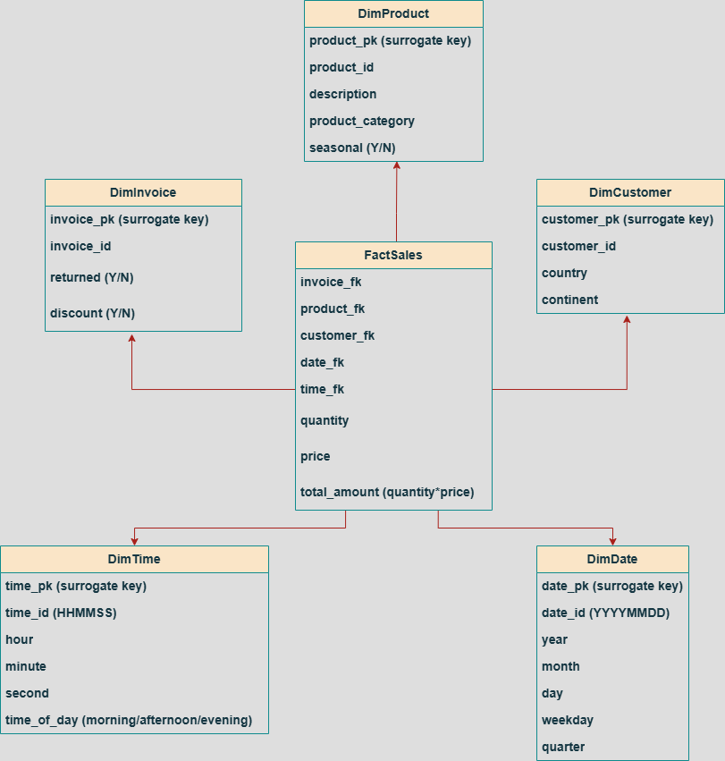
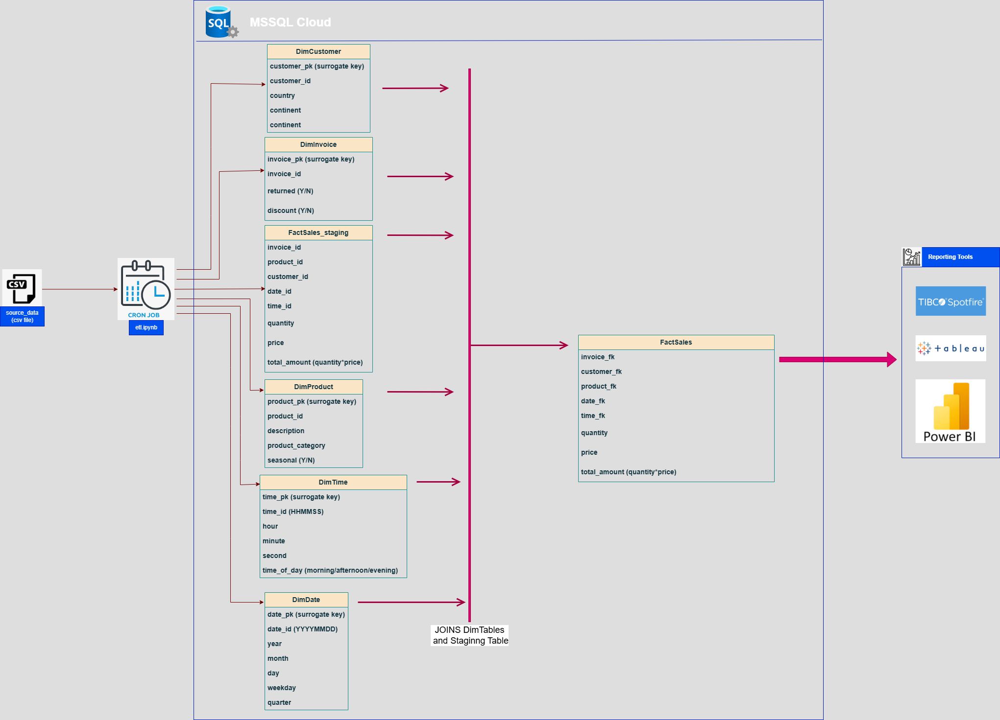

# Data Engineering Assessment – Kimball DWH Implementation

This repository contains the implementation of a Data Warehouse solution based on the Kimball methodology. The assessment was designed around transactional data from an `invoices.xls` source and includes a full ETL pipeline and dimensional modeling approach.

## 📌 Objective

- Design a star-schema Data Warehouse using Kimball best practices
- Implement a full ETL pipeline in Python
- Populate the data warehouse into a SQL Server instance
- Detect and handle data abnormalities
- Deliver useful reporting aggregations

## 📂 Repository Structure

├── src/ → SQL scripts and parameters

├── notebooks/ → ETL pipeline in Jupyter Notebook

├── docs/ → Architecture & data model diagrams

├── data/ → Input data file

├── output/ → Reporting queries

├── report.pdf → Detailed documentation

└── README.md

markdown
Copy
Edit

## 🧱 Schema Overview

- **Fact Table:** FactSales (quantities, pricing, total_amount)
- **Dimension Tables:** DimCustomer, DimProduct, DimInvoice, DimDate, DimTime
- **Staging Table:** FactSales_Staging

  

## 🔄 ETL Pipeline

Implemented in `notebooks/etl.ipynb`, the pipeline includes:

- Data extraction & cleaning
- Dimension enrichment (e.g. continent, category, time of day)
- Fact table population via surrogate keys
- Quality checks & normalization

  

## 📊 Reporting Aggregations

SQL queries demonstrating the warehouse's utility:

1. Top 10 customers by quantity purchased
2. Total sales per month & product category
3. Return rate per country

## 📄 References

- `report.pdf` includes full documentation, assumptions, abnormalities, and query samples.
- `src/create_statements.sql` includes all table DDLs.
- `params.json` contains enrichment dictionaries and connection parameters.

## 📝 License

Distributed under the [MIT License](LICENSE).
